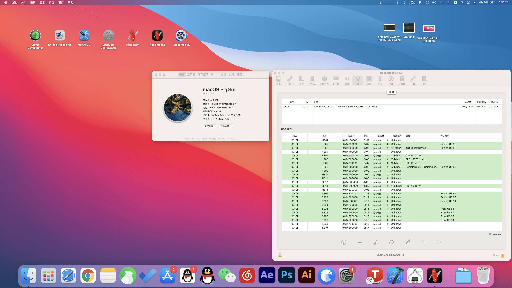
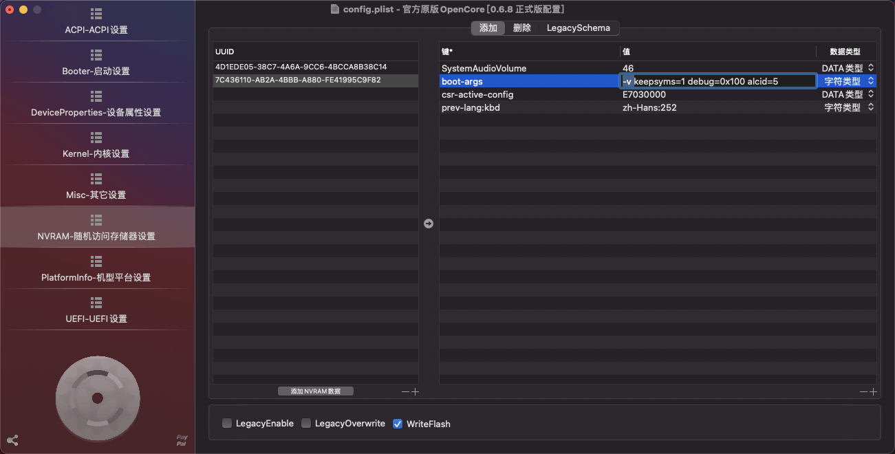
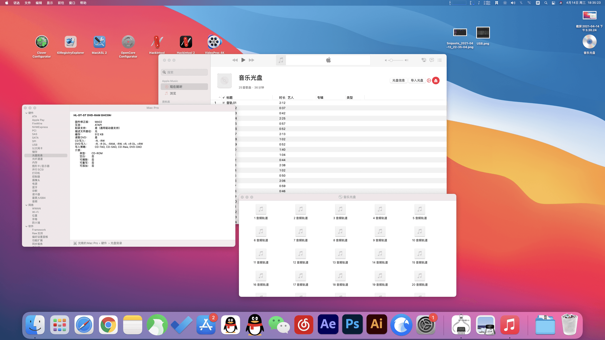

# Lenovo-ThinkStation-P520-Hackintosh

## 最新情况
启动：`Opencore 6.8`

系统：`Big Sur 11.2.2`

测试环境：`Catalina 10.15.6` **--OTA-->** `Big Sur 11.2.2`

## 系统版本

*如有问题(bug)请提交issue。（如果我能修就找个空闲时间修）*

Big Sur 11.2.2(20D80) - 2021.04.14

### Big Sur 11.2.2(20D80)

下载：[Download](https://github.com/Tamshen/Lenovo-ThinkStation-P520-Hackintosh/archive/refs/heads/main.zip)

#### 日志
1. 首先感谢 Opencore 技术交流群的老哥 qq@3106142068（下面简称老哥），帮我解决了本次OAT升级的问题。
2. RTC出错：老哥原话`你这个和 X299 一个毛病 怪不的11.0 提示 RTC noncontiguous device registry map entries `，关于X299->[个人小结 7](#个人小结)
3. RTC解决方案：`SSDT-RTC0-RANGE.aml`(老哥帮我弄得),过后搜索到：https://github.com/acidanthera/OpenCorePkg/blob/master/Docs/AcpiSamples/Source/SSDT-RTC0-RANGE.dsl
4. PCIe出错：`-v`跑码卡PCIe设备超时，SLT6无线网卡，老哥使用`IORegistryExplorer`查询是`BCM943224`网卡，原因是`这个网卡超时了 它10.15 用的驱动 11.0 里被Apple删了所以超时`
5. PCIe SLT6 解决方案：更新驱动`AirPortBrcmFixup`
6. 其它驱动没更新，黑屏：`-v`跑码完毕，黑屏，但是键盘灯正常（`驱动一直都没更新吧 版本都有点低 `）
7. 我把EFI打包给了老哥，老哥帮我更新了，然后替换成功进入系统。
8. 前面板USB口无法使用无线鼠标，通过老哥指点，SSxx只管3.0，HSxx2.0
9. USB解决方案，bak掉以前EFI的USB定制`USBPorts.kext`
10. 取消了`-v`

#### 问题

暂无，睡眠正常。

Catalina 10.15.6(19G2021) - 2021.01.14

### Catalina 10.15.6(19G2021)

下载：[Download](https://github.com/Tamshen/Lenovo-ThinkStation-P520-Hackintosh/releases/tag/v1)

#### 日志
- 此版本来自 [远景论坛 **pcbeta@jackliu79**](http://bbs.pcbeta.com/forum.php?mod=viewthread&tid=1857515) （**pcbeta@许峰** 去除了 **dsdt**）
- 此版本定制了USB

#### 问题

暂无。

## 配置清单

| 硬件     |                                                |
| :-------- | :-------------------------------------------------- |
| 主板     | 联想 1036 ( C422 芯片组)                           |
| 处理器   | 英特尔 Xeon(至强) W-2150B @ 3.00GHz                |
| 内存     | 三星 ECC REG 16 GB ( DDR4 2666MHz )  * 1           |
| 硬盘1    | 西数 固态 SN750 500 GB                             |
| 硬盘2    | 西数 蓝盘 4TB                                      |
| 显卡     | Quadro K2000 2GB ( DDR5 )                          |
| 声卡1    | ALC662 ( 未注入[个人小结 6](#个人小结) )                                  |
| 声卡2    | ALC235 ( 未注入[个人小结 6](#个人小结) )                                  |
| 网卡     | 英特尔 Ethernet Connection  I219-LM / 联想         |
| 网卡2    | [PCIe]BCM943224PCIEBT2BX（bigsur要打驱动[个人小结 5](#个人小结) ） |
| 电源     | 台达 690W（电源安装设计有意思，类似PCIe插槽，电源直接走主板）                    |
| 光驱     | 日立-LG DVD-RAM GHC0N DVD刻录机（免驱？）                    |

        

## 个人小结

1. **整机电源和主板集成很高，如果坏了很难受（但是几率不大）。**
2. 在装机之前，就物色好了30系显卡，于是3070刚出就买了一块，但双显卡3070风道不合适，然后macOS没驱动，能进系统，但是显存只有8MB，于是转Window使用了。（3070 5888的CUDA Vray渲图真快）
3. BIOS可以设置默认PCIe，切换首选显卡输出，但总感觉很麻烦和鸡肋。
4. 2021年3月初，3070被上海一位老板卖走了（不渲染，不打游戏有点性能过剩），用回K2000了...
5. BCM943224在bigsur取消支持了，需要打驱动，支持隔空投送，信号在win一般，mac还可以？
6. 根据*pcbeta@许峰*网友的交谈和了解，他有个同型号声卡的联想机器，注入后损坏，所以这个有几率会损坏声卡（请自行斟酌，非必须建议不注入，原因见第一小点，个人一般用显示器的耳机口或者蓝牙）
7. 主板是C422和X299一样的2066针脚接口（C422只支持ECC REG内存）
>- 一些资料：https://zhuanlan.zhihu.com/p/65383548
>- 从X299开始，至强E5改名至强W工作站系列，只允许运行在特定的C422芯片组上
>- X299只能上LGA2066接口的i5/i7/i9处理器，但是无法点亮接口一模一样、架构也一模一样的LGA2066至强W系列

